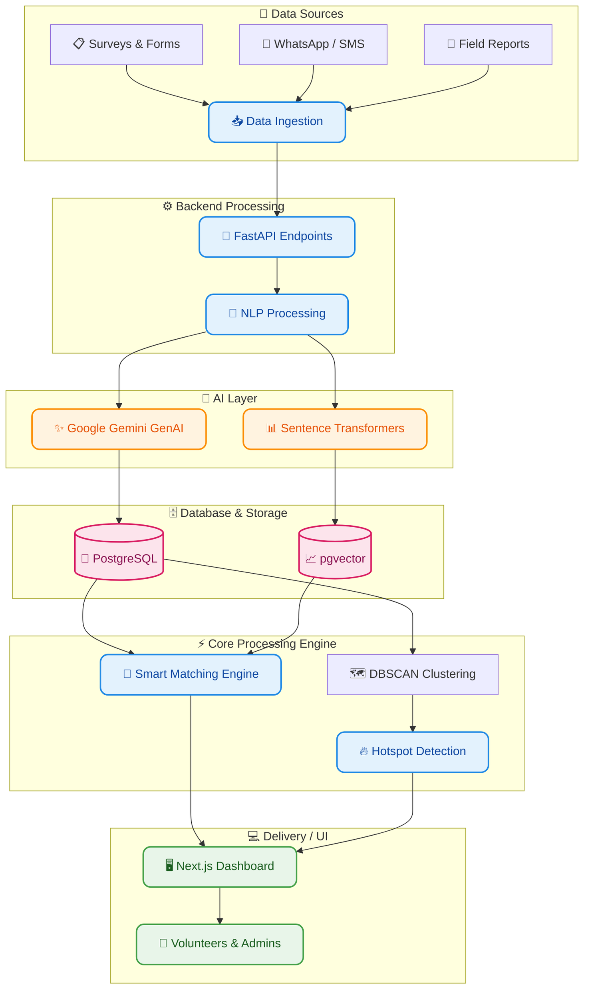
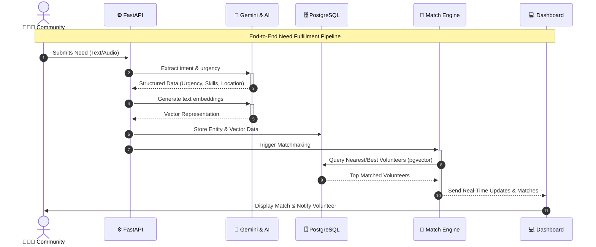

  

  <h1 align="center">🚀 SevaSetu</h1>
  <h3 align="center">AI-Powered Smart Resource Allocation Platform</h3>

  

    <strong>Bridging community needs with the right help using AI.</strong> 
    <em>Let's build the future with AI.</em>
  

  

    
    
    
  

## 🌍 Overview

Are you a student developer ready to create a difference? **SevaSetu** is built for the **Google Solution Challenge 2026 India** to solve real-world humanitarian problems using Google developer technologies.

SevaSetu is an AI-driven platform that transforms **scattered community data** into **actionable intelligence** and enables **smart volunteer coordination**. It aggregates inputs from multiple sources (surveys, WhatsApp, field reports) and uses **Generative AI + Semantic Matching** to:

  <table>
    <tr>
      <td align="center">🚨 <b>Identify</b></td>
      <td align="center">🚦 <b>Prioritize</b></td>
      <td align="center">🤝 <b>Match</b></td>
    </tr>
    <tr>
      <td>Urgent needs in real-time.</td>
      <td>Critical situations autonomously.</td>
      <td>The right volunteers efficiently.</td>
    </tr>
  </table>

## 🧠 Core Idea

  <h3><code>Raw Data ➔ AI Intelligence ➔ Smart Allocation ➔ Real Impact</code></h3>

## ❗ Problem Statement vs 💡 Our Solution

| The Problem 🌪️ | The Solution 🎯 |
| :--- | :--- |
| **Scattered Data:** Information siloed across social media and apps. | **Multi-source Ingestion:** Collects distress signals globally. |
| **No Prioritization:** Hard to rank urgent vs. non-urgent needs. | **AI Understanding:** Gemini extracts context & urgency. |
| **Inefficient Assignment:** Volunteers misallocated. | **Smart Matching:** Finds best volunteer via vector similarity. |
| **Lack of Visibility:** No geographical mapping. | **Real-time Dashboards:** Live heatmaps and analytics. |

## ⚙️ Key Features

* 🔍 **Intelligent Need Extraction:** Automatically structures unstructured inputs (need, urgency, location, required skills).
* 🎯 **Smart Volunteer Matching Engine:** Matches based on Skills, Location, Availability, and Urgency.
* 📡 **Real-Time Data Aggregation:** Unifies data channels.
* 🗺️ **Hotspot Detection:** Identifies high-risk areas using DBSCAN clustering.
* 📈 **AI Insights & Prioritization:** Recommends actionable decisions to admins.
* 🔄 **Feedback Learning System:** Continuous improvement in matching accuracy.

## 🏗️ Architecture Diagram

## 🔄 Process Flow

## 🧪 Tech Stack

  
| 🧠 AI / ML | ⚙️ Backend | 🗄️ Database | 🌐 Frontend |
| :---: | :---: | :---: | :---: |
|     |     |     |     |

## 🎯 Unique Selling Proposition (USP)

<b>Click to reveal what makes SevaSetu unique!</b>

 

* 🤖 **Data-driven Resource Allocation:** Completely autonomous and AI-powered.
* 🗣️ **Multilingual AI Understanding:** Breaks language barriers using Gemini.
* 📏 **Smart Multi-factor Matching:** Looks at location, skills, and urgency simultaneously.
* 🚨 **Real-time Crisis Detection:** Proactive clustering of distress signals.
* 🔎 **Explainable AI Decisions:** Transparent reasons for why a volunteer was chosen.

## 🔮 Future Scope

* 🔮 **Predictive Crisis Detection:** Using historical data to predict outbreaks or shortages.
* 📱 **Social Media Integration:** Real-time tweet and post scraping for distress signals.
* 🏛️ **Government-level Deployment:** Scaling up for disaster management agencies.
* 🎁 **Personalized Volunteer Recommendations:** Gamified rewards based on AI history.

## 👥 Meet the Developers

Proudly built by:
* 👨‍💻 **Er. Ujjwal Chaudhary**
* 👨‍💻 **Er. Ayush Gourav**

  <h2>🏆 Built For</h2>
  
  
<em>Build with AI — Let's build the future with AI.</em>

  
   
  
  <h3><strong>“From scattered data to intelligent humanitarian action.”</strong></h3>

