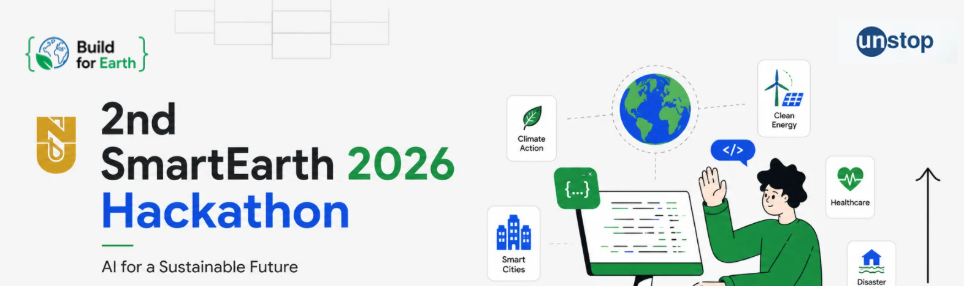
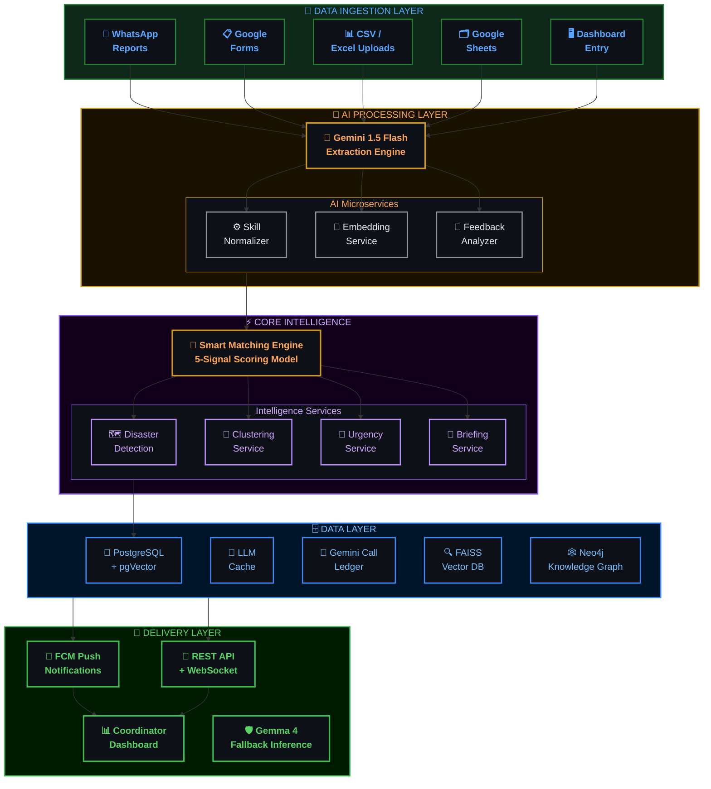

<div align="center">



<br/>

```
███████╗███████╗██╗   ██╗ █████╗ ███████╗███████╗████████╗██╗   ██╗
██╔════╝██╔════╝██║   ██║██╔══██╗██╔════╝██╔════╝╚══██╔══╝██║   ██║
███████╗█████╗  ██║   ██║███████║███████╗█████╗     ██║   ██║   ██║
╚════██║██╔══╝  ╚██╗ ██╔╝██╔══██║╚════██║██╔══╝     ██║   ██║   ██║
███████║███████╗ ╚████╔╝ ██║  ██║███████║███████╗   ██║   ╚██████╔╝
╚══════╝╚══════╝  ╚═══╝  ╚═╝  ╚═╝╚══════╝╚══════╝   ╚═╝    ╚═════╝
```

### 🌍 AI-Powered Disaster Response & Volunteer Coordination Platform
#### *Transforming Fragmented Disaster Data into Intelligent Humanitarian Action*

<br/>

[](https://sevasetu-242a8.web.app/)
[](https://github.com/oyyPoodles/2nd-SmartEarth-2026-Hackathon)
[](#)

<br/>


<br/>

> **🏆 Built for the 2nd SmartEarth 2026 Hackathon**
> **Theme: AI & Robotics for Disaster Management** · *Organized by Nazarbayev University × Unstop × Build for Earth*

<br/>

---

</div>

## 📌 Table of Contents

- [🚨 The Problem](#-the-problem)
- [💡 Our Solution](#-our-solution)
- [🧠 How AI Powers SevaSetu](#-how-ai-powers-sevasetu)
- [⚡ Key Features](#-key-features)
- [🏗️ System Architecture](#%EF%B8%8F-system-architecture)
- [🔄 User Interaction Flow](#-user-interaction-flow)
- [🛠️ Tech Stack](#%EF%B8%8F-tech-stack)
- [📊 Why SevaSetu Wins](#-why-sevasetu-wins)
- [🌱 Impact & Target Users](#-impact--target-users)
- [📸 Prototype Snapshots](#-prototype-snapshots)
- [🔮 Future Roadmap](#-future-roadmap)
- [💰 Cost Estimate](#-cost-estimate)
- [👨‍💻 Team](#-team)

---

## 🚨 The Problem

> *"Thousands of community needs go unmet daily — not due to lack of resources, but due to lack of intelligent coordination."*

During disasters — floods, earthquakes, landslides, cyclones — critical information floods in from everywhere simultaneously:

| Source | Problem |
|--------|---------|
| 📱 Social Media | Unstructured, noisy, multilingual |
| 📋 Field Reports | Siloed, delayed, inconsistent formats |
| 📞 Emergency Calls | Unrecorded, manually processed |
| 🗺️ NGO Surveys | Fragmented, no centralized view |
| 💬 WhatsApp Messages | Informal, unstructured, hard to parse |

**The result?**

```
❌ Delayed disaster response and aid delivery
❌ Volunteers assigned without skill/location matching
❌ Critical needs remain unmet in vulnerable communities
❌ No real-time visibility into disaster hotspots
❌ Resource duplication and coordination failures
```

---

## 💡 Our Solution

<div align="center">

### SevaSetu = **सेवा** (Service) + **सेतु** (Bridge)
#### *Bridging the gap between scattered disaster data and intelligent action*

</div>

SevaSetu is an **end-to-end AI-powered platform** that ingests fragmented emergency data from any source, understands it with Generative AI and NLP, and converts it into prioritized, actionable response plans — connecting the **right volunteers** to the **right people** at the **right time**.

```
📡 Multi-Source Data          🤖 AI Processing              🎯 Intelligent Action
━━━━━━━━━━━━━━━━             ━━━━━━━━━━━━━━━━              ━━━━━━━━━━━━━━━━━━
WhatsApp Messages     ──▶    Gemini Extraction    ──▶    Volunteer Matching
Field Reports               Multilingual NLP              Hotspot Detection
Social Media Posts          Urgency Scoring               Priority Dashboards
Emergency Forms             Semantic Matching             Real-Time Alerts
NGO Surveys                 Clustering Engine             Deployment Plans
```

---

## 🧠 How AI Powers SevaSetu

Google Gemini 1.5 Flash is the core intelligence layer of SevaSetu:

```
┌─────────────────────────────────────────────────────────────────┐
│                    🤖 GEMINI AI PIPELINE                        │
├─────────────┬─────────────┬─────────────┬───────────────────────┤
│  📝 INPUT   │ 🧠 PROCESS  │ 📦 EXTRACT  │    🎯 OUTPUT          │
│             │             │             │                       │
│ Multilingual│ Understand  │ Disaster    │ Prioritized Needs     │
│ unstructured│ context &   │ Type        │ Volunteer Matches     │
│ disaster    │ semantics   │ Urgency     │ Risk Assessments      │
│ reports     │             │ Location    │ Response Plans        │
│             │             │ Resources   │ Deployment Alerts     │
└─────────────┴─────────────┴─────────────┴───────────────────────┘
```

### AI Capabilities

- 🌐 **Multilingual Understanding** — Processes Hindi, English, regional languages
- 📊 **Urgency Scoring** — Automatic criticality detection and ranking
- 🎯 **Semantic Matching** — Embeddings-based volunteer-to-need pairing
- 💡 **Explainable Recommendations** — Transparent, auditable AI decisions
- 🔄 **Fallback Resilience** — Gemma 4 local inference when Gemini is unavailable

---

## ⚡ Key Features

<table>
<tr>
<td width="50%">

### 🔍 Intelligent Disaster Extraction
Converts multilingual, unstructured reports into structured data:
- Disaster Type & Severity
- Urgency Level (Critical / High / Medium)
- Affected Location (geocoded)
- Resource Requirements
- Required Volunteer Skills

</td>
<td width="50%">

### 🤝 Smart Volunteer Matching
Assigns the most suitable responders using a 5-signal scoring model:
- ✅ Skill alignment
- ✅ Geographic proximity
- ✅ Real-time availability
- ✅ Reliability score
- ✅ Emergency priority weight

</td>
</tr>
<tr>
<td width="50%">

### 🗺️ Disaster Hotspot Detection
Identifies emerging crisis zones before they escalate:
- Geospatial clustering of incident reports
- Anomaly detection for sudden spikes
- Real-time heatmap visualization
- Predictive zone alerting

</td>
<td width="50%">

### 📊 AI Decision Support Engine
Empowers coordinators with:
- Prioritized incident rankings
- Actionable response recommendations
- Risk assessment summaries
- Automated deployment briefings

</td>
</tr>
<tr>
<td width="50%">

### 📡 Real-Time Data Aggregation
Unified pipeline from:
- WhatsApp / Messaging platforms
- Google Forms / Surveys
- Social media feeds
- Field CSV/Excel reports
- Dashboard manual entry

</td>
<td width="50%">

### 🧠 Resilient AI Stack
Built for real-world reliability:
- **Primary:** Google Gemini 1.5 Flash
- **Fallback:** Gemma 4 (local inference)
- Zero downtime during API failures
- Adaptive learning from feedback

</td>
</tr>
</table>

---

## 🏗️ System Architecture



---

## 🔄 End-to-End Workflow

```mermaid
flowchart LR
    classDef actor fill:#0d1117,stroke:#58a6ff,stroke-width:2.5px,color:#58a6ff,font-weight:bold,rx:50
    classDef step1 fill:#0d1117,stroke:#ff7b72,stroke-width:2px,color:#ff7b72,font-weight:bold
    classDef step2 fill:#0d1117,stroke:#ffa657,stroke-width:2px,color:#ffa657,font-weight:bold
    classDef step3 fill:#0d1117,stroke:#d2a8ff,stroke-width:2px,color:#d2a8ff,font-weight:bold
    classDef step4 fill:#0d1117,stroke:#79c0ff,stroke-width:2px,color:#79c0ff,font-weight:bold
    classDef step5 fill:#0d1117,stroke:#56d364,stroke-width:2px,color:#56d364,font-weight:bold
    classDef outcome fill:#0d1117,stroke:#3fb950,stroke-width:3px,color:#3fb950,font-weight:bold
    classDef gemini fill:#1a1200,stroke:#d29922,stroke-width:2.5px,color:#ffa657,font-weight:bold

    CITIZEN(["👤 Citizen\nNGO / Responder"]):::actor

    subgraph REPORT["  1️⃣  INCIDENT REPORTED  "]
        direction TB
        R1["📱 WhatsApp\nMessage"]:::step1
        R2["📋 Online\nForm"]:::step1
        R3["🎙️ Voice / Audio\nReport"]:::step1
        R4["📷 Image /\nPhoto"]:::step1
    end

    subgraph EXTRACT["  2️⃣  AI EXTRACTION  "]
        direction TB
        GX["🤖 Gemini\nExtraction Engine"]:::gemini
        E1["🔥 Disaster\nType"]:::step2
        E2["⚡ Urgency\nLevel"]:::step2
        E3["📍 Affected\nLocation"]:::step2
        E4["🛠️ Resources\nRequired"]:::step2
        E5["👷 Skills\nNeeded"]:::step2
        GX --> E1 & E2 & E3 & E4 & E5
    end

    subgraph VALIDATE["  3️⃣  VALIDATE & TRIAGE  "]
        direction TB
        V1["🔁 Duplicate\nRemoval"]:::step3
        V2["🗺️ Geocoding &\nHotspot Detection"]:::step3
        V3["📊 Priority\nScoring"]:::step3
    end

    subgraph MATCH["  4️⃣  VOLUNTEER MATCHING  "]
        direction TB
        M1["🎯 Skill\nAlignment"]:::step4
        M2["📍 Proximity\nScore"]:::step4
        M3["🕐 Real-Time\nAvailability"]:::step4
        M4["⭐ Reliability\nRating"]:::step4
        ME["⚙️ 5-Signal\nMatching Engine"]:::gemini
        M1 & M2 & M3 & M4 --> ME
    end

    subgraph REVIEW["  5️⃣  COORDINATOR REVIEW  "]
        direction TB
        CR1["💡 Explainable AI\nRecommendations"]:::step5
        CR2["⚠️ Risk\nAssessment"]:::step5
        CR3["📋 Response\nPlan Generated"]:::step5
    end

    DEPLOY(["✅ RESOURCE DEPLOYED\n\nRight Person · Right Place\nRight Time · Maximum Impact"]):::outcome

    VOLUN(["👥 Volunteers\nNotified via FCM"]):::actor
    COORD(["🖥️ Coordinator\nDashboard Updated"]):::actor

    CITIZEN --> R1 & R2 & R3 & R4
    R1 & R2 & R3 & R4 --> GX
    E1 & E2 & E3 & E4 & E5 --> V1 & V2 & V3
    V1 & V2 & V3 --> M1 & M2 & M3 & M4
    ME --> CR1 & CR2 & CR3
    CR1 & CR2 & CR3 --> DEPLOY
    DEPLOY --> VOLUN & COORD

    style REPORT fill:#1a0000,stroke:#ff7b72,stroke-width:2px
    style EXTRACT fill:#1a1200,stroke:#d29922,stroke-width:2px
    style VALIDATE fill:#12001a,stroke:#8957e5,stroke-width:2px
    style MATCH fill:#001529,stroke:#388bfd,stroke-width:2px
    style REVIEW fill:#001a00,stroke:#3fb950,stroke-width:2px
```



---

## 🛠️ Tech Stack

<table>
<tr>
<th>Layer</th>
<th>Technologies</th>
</tr>
<tr>
<td>🤖 <b>AI / ML</b></td>
<td>Google Gemini 1.5 Flash · Gemma 4 (Fallback) · Llama 3.3 70B (Groq/Ollama) · Sentence Transformers · HuggingFace NLP · RAG</td>
</tr>
<tr>
<td>⚙️ <b>Backend</b></td>
<td>FastAPI · Python · AsyncPG · SQLAlchemy · REST APIs · Orchestrator Services</td>
</tr>
<tr>
<td>🗄️ <b>Database</b></td>
<td>PostgreSQL · pgVector · FAISS Vector DB · Neo4j (Knowledge Graph) · Redis (Caching) · Event Clustering Engine</td>
</tr>
<tr>
<td>🎨 <b>Frontend</b></td>
<td>Next.js (React) · Tailwind CSS · Framer Motion · React Simple Maps</td>
</tr>
<tr>
<td>☁️ <b>Infrastructure</b></td>
<td>Google Cloud Platform · AWS (EC2, S3, RDS) · Docker · Nginx · Firebase Hosting</td>
</tr>
<tr>
<td>📡 <b>Data Sources</b></td>
<td>WhatsApp Business API · Google Forms · CSV/Excel Uploads · Social Media Feeds · Field Reports</td>
</tr>
<tr>
<td>📊 <b>Analytics</b></td>
<td>Geospatial Clustering · Anomaly Detection · BigQuery · Looker Studio</td>
</tr>
</table>

---

## 📊 Why SevaSetu Wins

| Existing Systems | ✅ SevaSetu Solution |
|-----------------|----------------------|
| Disaster data scattered across silos | AI-driven aggregation into unified platform |
| Manual volunteer assignment (slow, inaccurate) | Intelligent 5-signal matching engine |
| No real-time visibility into crisis zones | Live geospatial hotspot detection |
| Language barriers slow emergency response | Multilingual NLP — any language, any format |
| Black-box AI decisions | Explainable AI with transparent reasoning |
| Connectivity-dependent AI | Gemma 4 fallback for offline inference |

### 🏅 Unique Selling Propositions

```
✦ Only platform combining real-time multi-source ingestion + AI triage + volunteer dispatch
✦ Explainable AI — coordinators understand WHY every recommendation is made
✦ Works in low-connectivity environments via Gemma 4 local fallback
✦ Feedback-driven adaptive learning — gets smarter after every deployment
✦ Built for scale: governments, NGOs, and relief networks
```

---

## 🌱 Impact & Target Users

### Who Uses SevaSetu?

```
🏛️  Government Emergency Management Departments
🌐  NGOs & Humanitarian Relief Organizations
🚑  Hospitals, Shelters & Emergency Support Centers
👥  Volunteer Networks & Community Responders
📋  Field Coordinators & Disaster Response Agencies
```

### Measurable Impact

- ⚡ **Faster Response** — Right volunteer deployed in real-time
- 🎯 **Better Matching** — Skill + proximity + urgency aligned
- 🗺️ **Wider Reach** — Underserved areas identified via hotspot maps
- 💰 **Efficient Resources** — Zero duplication, optimized allocation
- 📈 **Data-Driven Decisions** — Actionable insights over gut-feel

---

## 📸 Prototype Snapshots

> 🔗 **[Try the Live Prototype →](https://sevasetu-242a8.web.app/)**

The working prototype includes:

| Module | Description |
|--------|-------------|
| 🏠 Landing Page | AI-powered volunteer coordination hub with live stats |
| 📊 Command Center | Real-time map with hotspot overlays and incident tracking |
| 🤖 SevaBot Chat | AI assistant with live access to needs, volunteers & crisis data |
| 📋 Needs Board | Filterable incident listings by type, urgency, and status |
| ➕ Report a Need | AI-powered need submission with auto-classification |
| 👥 Volunteer Dashboard | Profile management and assignment tracking |

---

## 🔮 Future Roadmap

```
Q3 2026  ──▶  Vertex AI Disaster Prediction Engine
              ↳ Predict hotspots BEFORE they become critical

Q3 2026  ──▶  Vertex AI Multimodal Pipeline
              ↳ Process text + images + audio + video in one pipeline

Q4 2026  ──▶  Gemini Embeddings for Smarter Matching
              ↳ Cross-lingual semantic alignment for volunteers & needs

Q4 2026  ──▶  Google Maps Route-Aware Dispatch
              ↳ Recommend by actual travel time, not just distance

Q1 2027  ──▶  Emergency Broadcast System
              ↳ Targeted push alerts based on disaster type + skills

Q1 2027  ──▶  Impact Analytics Dashboard (BigQuery + Looker Studio)
              ↳ Response time trends, bottlenecks, effectiveness KPIs
```

---

## 💰 Cost Estimate

> Prototype built with a lean, cost-efficient stack — **maximum impact at minimum cost.**

| Component | Details |
|-----------|---------|
| ☁️ Cloud Infrastructure | Google Cloud Platform (free tier) |
| 🤖 AI Engine | Gemini API + open-source embeddings |
| 🗄️ Database | PostgreSQL + pgVector |
| 📡 Integrations | WhatsApp + Dashboard + Form-based reporting |
| **💵 Estimated Total** | **₹3,000 – ₹8,000 (Prototype Stage)** |

*Costs scale proportionally as operations and deployment expand.*

---

## 👨‍💻 Team

<div align="center">

| | Name | Role |
|---|------|------|
| 👑 | **Ayush Gourav** | Team Leader · Full Stack & Platform Architecture |
| 🤖 | **Ujjwal Chaudhary** | AI/ML Developer · NLP & Matching Engine |

**Team Name:** SevaSetu
**Hackathon:** 2nd SmartEarth 2026 — *AI for a Sustainable Future*

</div>

---

## 🔗 Links

| | Link |
|--|------|
| 🌐 Live Prototype | [sevasetu-242a8.web.app](https://sevasetu-242a8.web.app/) |
| 💻 GitHub Repository | [github.com/oyyPoodles/2nd-SmartEarth-2026-Hackathon](https://github.com/oyyPoodles/2nd-SmartEarth-2026-Hackathon) |
| 🎥 Demo Video | Coming Soon |

---

<div align="center">

<br/>

```
 ╔══════════════════════════════════════════════════════════╗
 ║                                                          ║
 ║   From Scattered Disaster Data to Intelligent Action     ║
 ║                                                          ║
 ║              🌍  S E V A S E T U  🌍                    ║
 ║                                                          ║
 ║      AI-Powered · Multilingual · Explainable             ║
 ║      Real-Time · Scalable · Human-Centered               ║
 ║                                                          ║
 ╚══════════════════════════════════════════════════════════╝
```

**Built with ❤️ for humanity · 2nd SmartEarth 2026 Hackathon**

*AI for a Sustainable Future*

</div>
