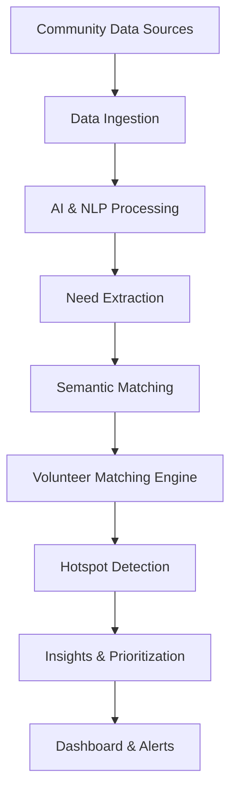

<div align="center">


# 🌍 SevaSetu

### AI-Powered Disaster Response & Volunteer Coordination Platform

**Transforming fragmented disaster information into intelligent humanitarian action**

*Built for the 2nd SmartEarth 2026 Hackathon*

<br>

[](https://sevasetu-242a8.web.app/)


</div>

---

# 🌍 Overview

SevaSetu is an AI-powered disaster response and volunteer coordination platform designed to transform fragmented emergency information into actionable intelligence.

During disasters such as floods, earthquakes, landslides, storms, and humanitarian crises, critical information arrives from multiple sources including social media, emergency reports, NGO surveys, WhatsApp messages, field reports, and community submissions.

SevaSetu leverages Generative AI, Natural Language Processing, Semantic Search, and Geospatial Analytics to extract critical information such as:

- Disaster Type
- Urgency Level
- Location
- Resource Requirements
- Volunteer Needs

The platform intelligently connects affected communities with the most suitable volunteers and responders while helping authorities identify disaster hotspots and emerging crisis zones in real time.

By converting scattered multilingual disaster reports into prioritized response plans, SevaSetu accelerates aid delivery, improves coordination, optimizes resource utilization, and enables faster decision-making during emergencies.

---

# 🚨 Problem Statement

During disasters, information about affected communities is scattered across multiple platforms and formats.

## Challenges

- Disaster data is fragmented across emergency reports, surveys, social media, and field updates.
- Volunteers are assigned manually without considering skills, availability, or location.
- Multilingual and unstructured reports slow emergency response.
- Authorities lack real-time visibility into affected areas and urgent needs.
- Resource allocation becomes inefficient during emergencies.

## Impact

- Delayed disaster response and aid delivery.
- Poor volunteer and resource coordination.
- Critical needs remain unmet.
- Increased risk to vulnerable communities.
- Reduced effectiveness of humanitarian operations.

> "Thousands of community needs go unmet daily, not due to lack of resources, but due to lack of intelligent coordination."

---

# 💡 Our Solution

## From Scattered Disaster Data to Intelligent Humanitarian Action

SevaSetu transforms fragmented disaster information into structured and prioritized response plans using Artificial Intelligence.

### Workflow

```text
Community Reports
        ↓
Data Aggregation
        ↓
AI & NLP Processing
        ↓
Need Extraction
        ↓
Volunteer Matching
        ↓
Hotspot Detection
        ↓
Prioritization Engine
        ↓
Dashboard & Alerts
        ↓
Faster Disaster Response
```

The system enables governments, NGOs, emergency responders, and humanitarian organizations to make faster and more informed decisions.

---

# 🧠 AI Role in SevaSetu

Artificial Intelligence acts as the core intelligence layer of SevaSetu.

### AI Capabilities

- Understands multilingual emergency reports.
- Extracts disaster-related information from unstructured text.
- Identifies urgency and severity levels.
- Generates actionable recommendations.
- Prioritizes incidents automatically.
- Supports real-time decision making.

### Google Gemini Integration

Google Gemini powers:

- Disaster Data Extraction
- Multilingual Understanding
- Semantic Analysis
- Response Planning
- Volunteer Coordination
- Decision Support

---

# ⚡ Key Features

## 🔍 Intelligent Disaster Information Extraction

Converts multilingual and unstructured disaster reports into structured information including:

- Disaster Type
- Urgency
- Location
- Resource Requirements
- Affected Population

using Google Gemini.

---

## 🤝 Smart Volunteer & Resource Matching

Assigns the most suitable volunteers and resources based on:

- Skills
- Proximity
- Availability
- Reliability
- Emergency Priority

---

## 📡 Real-Time Disaster Data Aggregation

Integrates data from:

- Emergency Reports
- NGO Surveys
- Social Media
- WhatsApp Messages
- Community Forms
- Field Updates

into a centralized platform.

---

## 🗺️ Disaster Hotspot Detection

Identifies:

- High-Risk Zones
- Emerging Crises
- Resource Shortages
- Priority Areas

using clustering and geospatial analytics.

---

## 📊 AI-Powered Prioritization & Decision Support

Generates:

- Actionable Insights
- Response Recommendations
- Risk Assessments
- Priority Rankings

for emergency coordinators.

---

## 🔄 Adaptive Learning System

Continuously improves matching accuracy and recommendations through feedback-driven optimization.

---

## 🧠 Resilient AI Stack

Uses:

- Google Gemini (Primary)
- Gemma 4 (Fallback)

to ensure continuous operation even during connectivity issues.

---

# 🎯 Why SevaSetu?

## Unique Selling Proposition (USP)

✅ AI-powered analysis of fragmented disaster information

✅ Intelligent volunteer matching based on skills, location, and urgency

✅ Real-time hotspot detection and geospatial analytics

✅ Multilingual disaster report understanding

✅ Explainable AI recommendations

✅ Faster resource allocation and response coordination

✅ Scalable architecture for governments and humanitarian organizations

---

# 🏗️ System Architecture



---

# 🔄 User Interaction Flow

## 1️⃣ Disaster Incident Reported

A citizen, NGO, field responder, or coordinator submits an emergency report through:

- WhatsApp
- Forms
- Social Media
- Text
- Audio
- Images

---

## 2️⃣ AI Extracts Critical Information

Google Gemini extracts:

- Disaster Type
- Urgency Level
- Affected Location
- Resource Requirements
- Affected Population
- Required Skills

---

## 3️⃣ System Validates & Prioritizes Requests

SevaSetu:

- Removes duplicates
- Geocodes locations
- Detects hotspots
- Prioritizes incidents

based on urgency and impact.

---

## 4️⃣ AI Matches Volunteers & Resources

The matching engine ranks volunteers using:

- Skills
- Proximity
- Availability
- Reliability
- Emergency Priority

---

## 5️⃣ Coordinator Reviews Recommendations

Gemini provides:

- Explainable Recommendations
- Risk Assessments
- Response Plans
- Deployment Suggestions

---

## 6️⃣ Resource Deployment

Authorities and responders execute the recommended action plan.

---

# 🛠 Technology Stack

## AI & Machine Learning

- Google Gemini 1.5 Flash
- Gemma 4
- Sentence Transformers
- Semantic Search
- NLP
- RAG

## Backend

- FastAPI
- Python
- REST APIs
- Async Processing

## Database

- PostgreSQL
- pgVector
- Redis

## Frontend

- Next.js
- React
- Tailwind CSS
- React Simple Maps

## Cloud & Infrastructure

- Google Cloud Platform
- Docker
- Nginx
- Firebase Hosting

## Analytics

- Geospatial Analytics
- Clustering
- Anomaly Detection

---

# 👥 Target Users

### Government Agencies

- Emergency Management Departments
- Disaster Response Authorities

### Humanitarian Organizations

- NGOs
- Relief Organizations

### Community Responders

- Volunteer Networks
- Local Responders
- Community Leaders

### Support Services

- Hospitals
- Shelters
- Emergency Support Centers

---

# 🌱 Potential Impact

SevaSetu helps:

- Reduce disaster response delays.
- Improve volunteer coordination.
- Optimize resource allocation.
- Detect emerging disaster hotspots.
- Prevent coordination failures.
- Improve situational awareness.
- Create transparent humanitarian ecosystems.
- Enhance disaster preparedness.

---

# 📸 Prototype Highlights

### Features Implemented

- Volunteer Dashboard
- AI Chat Assistant
- Need Submission Portal
- Command Center Dashboard
- Disaster Mapping Interface
- Incident Tracking System

---

# 🔮 Future Development

## Vertex AI Disaster Prediction Engine

Predict emerging disaster hotspots before they become critical.

---

## Vertex AI Multimodal Understanding

Process:

- Text
- Images
- Audio
- Video

within a unified disaster intelligence pipeline.

---

## Gemini Embeddings for Smarter Matching

Improve multilingual matching between:

- Volunteers
- Resources
- Emergency Needs

---

## Google Maps Route-Aware Dispatch

Recommend volunteers based on:

- Real Travel Time
- Accessibility
- Road Conditions
- Urgency

---

## AI-Powered Feedback Learning

Learn continuously from:

- Completed Assignments
- Response Outcomes
- User Feedback

---

## Emergency Broadcast System

Deliver targeted alerts to nearby volunteers based on:

- Disaster Type
- Location
- Skills
- Availability

---

## Impact Analytics Dashboard

Utilize:

- BigQuery
- Looker Studio

to monitor:

- Response Times
- Resource Utilization
- Operational Bottlenecks
- Disaster Response Effectiveness

---

# 💰 Prototype Deployment Cost

SevaSetu is designed as a scalable disaster-response platform that can be adopted by governments, NGOs, and humanitarian organizations.

### Prototype Cost

- Google Cloud Infrastructure
- Gemini API
- Open-Source Embedding Models
- PostgreSQL + pgVector
- Dashboard Deployment
- WhatsApp Integration

**Estimated Cost:** ₹3,000 – ₹8,000

---

# 👨‍💻 Team

### Ayush Gourav
**Team Leader**

### Ujjwal Chaudhary
**AI/ML Developer**

---

# 🔗 Links

### GitHub Repository

https://github.com/oyyPoodles/2nd-SmartEarth-2026-Hackathon

### Live Prototype

https://sevasetu-242a8.web.app/

### Demo Video

Coming Soon

---

# 🏆 Built For

## 🌍 2nd SmartEarth 2026 Hackathon

### Theme: AI & Robotics for Disaster Management

Building intelligent systems that leverage Artificial Intelligence to improve disaster response, volunteer coordination, and humanitarian impact.

---

<div align="center">

# 🌟 From Scattered Disaster Data to Intelligent Humanitarian Action

### SevaSetu

AI-Powered Disaster Intelligence & Volunteer Coordination Platform

**AI for a Sustainable Future**

</div>
